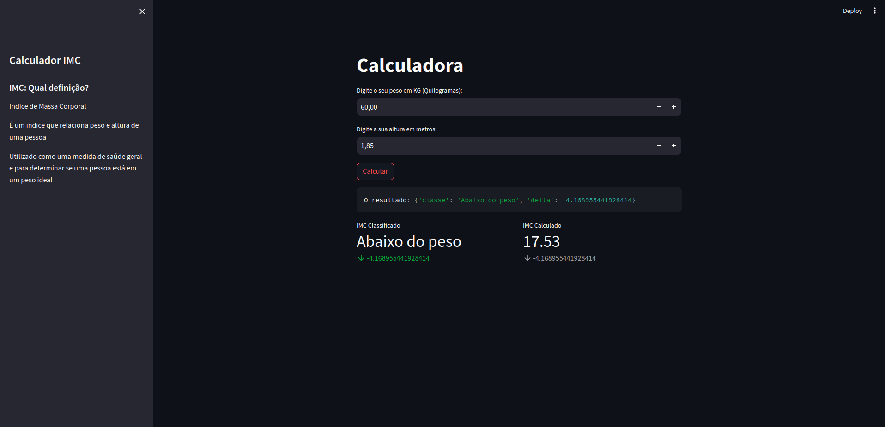

# Calculadora de IMC

Esta é uma aplicação de Calculadora de IMC (Índice de Massa Corporal) desenvolvida em Python utilizando o Streamlit. A aplicação permite que os usuários calculem seu IMC com base no peso e altura informados e fornece uma interpretação do índice resultante.

## Funcionalidades

- **Cálculo do IMC:** Os usuários podem inserir seu peso (em quilogramas) e altura (em metros) e calcular automaticamente o IMC.
- **Interpretação do IMC:** A aplicação fornece uma interpretação do IMC, indicando se o usuário está abaixo do peso, com peso normal, com sobrepeso ou obeso, conforme os padrões estabelecidos pela Organização Mundial da Saúde (OMS).

## Como Executar

1. Certifique-se de ter o Python instalado no seu sistema.
2. Instale as dependências do projeto usando o `pip`:
    ```
    pip install poetry
    ```
     ```
    poetry install
    ```
3. Execute a aplicação com o Streamlit:
    ```
    streamlit run imc.py
    ```
4. A aplicação será aberta em seu navegador padrão.  
  


## Dependências

- Python 3.x
- Streamlit
- Outras dependências especificadas em `pyproject.toml`

## Estrutura do Projeto
~~~
calculadora-imc/
├── imc.py
├── lib/
│ ├── init.py
│ ├── calc_imc.py
│ └── verificar_imc.py
├── README.md
└── requirements.txt